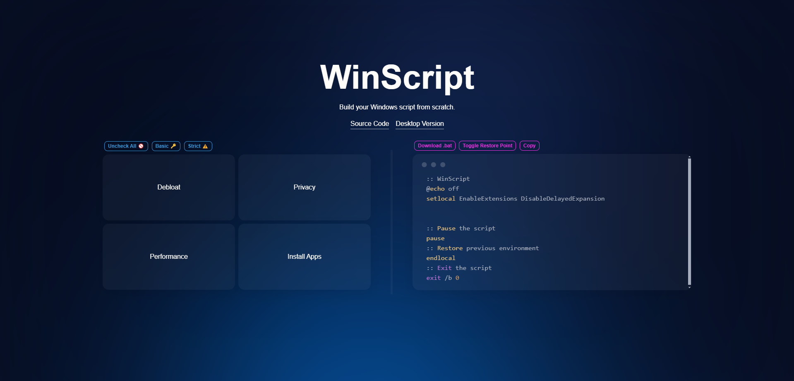

<h1 style="color: var(--cta);">WinScript Docs</h1>

> Open-source tool to build your Windows 10/11 script from scratch.

## What is it?

WinScript is an open-source tool to build your Windows 10/11 script from scratch.
It features debloat, privacy, performance & app installing scripts.

## Why should i use it?

Windows collects extensive user data through telemetry, including location, browsing history, and app usage, often without clear consent, raising privacy concerns. You can improve your privacy by using WinScript, which allows you to disable telemetry and data collection.

## Is it Open-Source?

WinScript is an open-source project licensed under GPL-3.0. It's completely free to use and transparent. If you want to contribute, please check the contributing guide.
